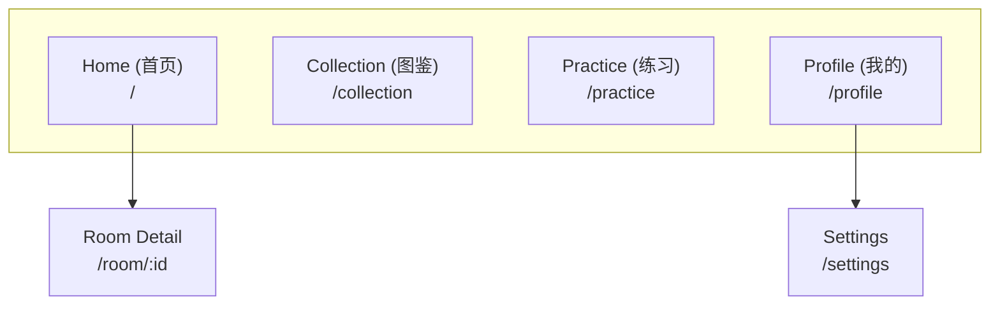

# Site Map: WordPet

```mermaid
flowchart TB
    subgraph TabBar[" "]
        direction LR
        Tab1["Home (首页)
/"]
        Tab2["Collection (图鉴)
/collection"]
        Tab3["Practice (练习)
/practice"]
        Tab4["Profile (我的)
/profile"]
    end

    %% Tab 1 - Home: pushed screens (TabBar hidden)
    Tab1 --> Room["Room Detail
/room/:id"]

    %% Tab 4 - Profile: pushed screens
    Tab4 --> Settings["Settings
/settings"]
```
